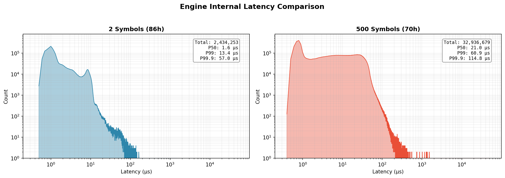

# TRCACHE

`trcache` is a C library for ingesting real-time trade data and transforming it into column-oriented, user-defined candle arrays. It uses lock-free data structures and dedicated worker threads to scale with available CPU cores.

---

## Features

- **User-Defined Input & Output**:
  - Accepts user-defined trade data structures.
  - Accepts user-defined candle structures (time-based, tick-based, or custom aggregations).
- **Lock-Free Candle Pipeline**:
  - **Apply**: Aggregates trades into row-oriented candles.
  - **Convert**: Transforms rows into SIMD-aligned column batches.
  - **Batch Flush**: Passes completed batches to user callbacks for persistence.
- **Raw Trade Flush**: Raw trade records are collected into fixed-size blocks per symbol and flushed to storage independently of candle batch flush.
- **Lock-Free Queries**: Reads candle data without locks during concurrent updates.
- **Adaptive Scheduling**: Admin thread monitors pipeline throughput and rebalances worker threads across stages.

---

## System Verification & Latency Breakdown

Data integrity and processing latency measured using live exchange data.

### Test Environment

| Parameter | Value |
|-----------|-------|
| Cloud | Google Cloud Platform |
| Region | asia-northeast1-c (Tokyo) |
| Instance | e2-custom-12-6144 |
| vCPU | 12 |
| Memory | 6 GB |
| Exchange | Binance Futures |
| WebSocket | wss://fstream.binance.com |

### Engine Configuration

| Parameter | Value |
|-----------|-------|
| Memory Limit | 2 GB |
| Worker Threads | 3 |
| Batch Size | 4,096 candles (2^12) |
| Cached Batches | 1 (2^0) |
| Candle Type | 5-tick |

### Latency Measurement

```
Exchange Server              Local Machine
      │                            │
      │      Network Latency       │
      ▼                            ▼
┌──────────┐                 ┌──────────┐                 ┌──────────┐
│ Binance  │  ─────────────▶ │   Feed   │  ─────────────▶ │ trcache  │
│  Server  │                 │ (parse)  │                 │  Engine  │
└──────────┘                 └──────────┘                 └──────────┘
     T0                           T1                           T2
                └─────────────────┘         └─────────────────┘
                 Network + Parsing            Engine Internal
                    (T1 - T0)                    (T2 - T1)
```

| Stage | Description |
|-------|-------------|
| **Network + Parsing** | Exchange event timestamp to WebSocket receive + JSON parsing complete. |
| **Engine Internal** | JSON parsing complete to candle update complete. |

### Test Scenarios

|  | Small-scale | Large-scale |
|--|-------------|-------------|
| Symbols | 2 (BTC, ETH) | 500 (Top USDT pairs) |
| WebSocket Connections | 1 | 3 |
| Feed Threads | 1 | 3 |
| Duration | ~86 hours | ~70 hours |

### Results

#### Data Integrity

| Metric | Description |
|--------|-------------|
| Gaps | Trade ID discontinuity at candle boundaries. |
| Tick Errors | Mismatch between expected and actual tick count per candle. |

| Test | Candles | Gaps | Tick Errors |
|------|---------|------|-------------|
| Small-scale (2 sym) | 2,434,253 | 0 | 0 |
| Large-scale (500 sym) | 32,935,900 | 0 | 0 |

#### Latency (Small-scale, 2 Symbols)

| Stage | P50 | P99 | P99.9 | Max |
|-------|-----|-----|-------|-----|
| Network + Parsing | 8.7 ms | 158.2 ms | 159.9 ms | >1 s |
| Engine Internal | 1.6 μs | 13.4 μs | 57.0 μs | 1.48 ms |

#### Latency (Large-scale, 500 Symbols)

| Stage | P50 | P99 | P99.9 | Max |
|-------|-----|-----|-------|-----|
| Network + Parsing | 10.3 ms | 159.6 ms | 161.7 ms | 590.1 ms |
| Engine Internal | 21.0 μs | 60.9 μs | 114.8 μs | 49.7 ms |

#### Engine Internal Latency Distribution



---

## Benchmark Stress Test

Feed threads push trades via direct function calls at maximum rate, with no network I/O overhead. This measures maximum throughput under stress conditions without network bottlenecks.

### Test Environment

| Parameter | Value |
|-----------|-------|
| CPU | Intel Core i5-13400F (16 cores) |
| RAM | 16 GB DDR5 5600MHz |

### Engine Configuration

| Parameter | Value |
|-----------|-------|
| Memory Limit | 5 GB |
| Batch Size | 16,384 candles (2^14) |
| Cached Batches | 1 (2^0) |
| Candle Types | 3-tick, 1-minute |

### Test Scenarios

| Parameter | Value |
|-----------|-------|
| Symbols | 1,024 |
| Distribution | Zipf (s=0.99) |

Zipf distribution simulates realistic market conditions where a small number of symbols receive disproportionately more trades. Higher s values increase this skew.

### Write Throughput (1 feed thread, 3 worker threads, no concurrent readers)

- **Feed Rate**: `15,485,115` trades/sec

### Query Latency: 10k Candles (3 Fields, Single Reader):

- **Static Read** (no concurrent writes):
  - P50: `6.2` μs
  - P99: `9.18` μs

- **Concurrent Read** (1 feed thread, 3 worker threads, feed rate: `14,869,372` trades/sec):
  - P50: `25.5` μs
  - P99: `56.4` μs

### Scalability

All measurements use 1 concurrent reader thread.

- **3 worker threads:**

| # of Feed Threads | Feed Rate (trades/sec) |  Query Latency (p50, μs) | Query Latency (p99, μs) | Peak Memory |       Status        |
|:-----------------:|:----------------------:|:------------------------:|:-----------------------:|:-----------:|:-------------------:|
|        1          |        14,869,372      |            25.5          |          56.4           |    3.2 GB   | ✓ Within limit      |
|        2          |        29,515,833      |            26.6          |          58.6           |    3.4 GB   | ✓ Within limit      |
|        3          |        38,570,051      |            28.7          |          76.9           |    7.2 GB   | ⚠ Exceeded limit   |

† *With 3 feed threads, memory usage reached 7.2GB, exceeding the configured 5GB limit.*

- **6 worker threads:**

| # of Feed Threads | Feed Rate (trades/sec) |  Query Latency (p50, μs) | Query Latency (p99, μs) | Peak Memory |       Status        |
|:-----------------:|:----------------------:|:------------------------:|:-----------------------:|:-----------:|:-------------------:|
|        1          |        13,215,539      |            27.4          |          68.5           |    4.37 GB  | ✓ Within limit      |
|        2          |        25,993,349      |            34.4          |          83             |    3.54 GB  | ✓ Within limit      |
|        3          |        39,593,103      |            40.2          |          92             |    2.96 GB  | ✓ Within limit      |
|        4          |        49,045,406      |            44.3          |          97.5           |    3.44 GB  | ✓ Within limit      |
|        5          |        56,809,017      |            50            |          283            |    6.16 GB  | ⚠ Exceeded limit   |

† *With 5 feed threads, memory usage reached 6.16GB, exceeding the configured 5GB limit.*

---

## Usage Rules

**[Planned]: Features or constraints targeted for optimization or removal in future releases.**
- The `max_symbols` capacity is pre-allocated at initialization and cannot be changed at runtime.
- The `total_memory_limit` is a hard cap; `trcache_feed_trade_data` will return -1 if this limit is exceeded.
- Initialization will fail if `total_memory_limit` is set lower than the minimum memory required by the configuration.
- The number of worker threads (`num_worker_threads`) must be greater than 2 (minimum 3).
- The system has hard-coded compile-time limits, such as `MAX_CANDLE_TYPES` (32) and `MAX_NUM_THREADS` (1024).

**[Fixed]: Permanent architectural constraints or safety policies that will remain unchanged.**
- Concurrent feeds to same symbol not supported, but single thread can handle feeding data for multiple symbols.
- `trcache_candle_base` must be the first member of any custom candle struct definition.

---

## Build

### Linux (Makefile)

**Release:**
```bash
make
```

**Debug:**
```bash
make BUILD_MODE=debug
```

### Windows (CMake, MSVC 64-bit)

**Release:**
```powershell
cmake -B build -A x64
cmake --build build --config Release
```

**Debug:**
```powershell
cmake -B build -A x64
cmake --build build --config Debug
```

### Windows (CMake, MinGW)

**Release:**
```powershell
cmake -B build -G "MinGW Makefiles"
cmake --build build
```

**Debug:**
```powershell
cmake -B build -G "MinGW Makefiles" -DCMAKE_BUILD_TYPE=Debug
cmake --build build
```

---

## Architecture

### Pipeline Overview

```
trcache_feed_trade_data()
         │
         ▼
  event_data_buffer (per-symbol)
         │
         ├──────────────────────────────────────────────────┐
         │                                                  │
         ▼                                                  ▼
  ┌──────────────┐    ┌──────────────┐    ┌─────────────┐  ┌──────────────┐
  │    APPLY     │───▶│   CONVERT    │───▶│ BATCH FLUSH │  │ TRADE FLUSH  │
  │  (Row AoS)   │    │ (Column SoA) │    │  (Persist)  │  │  (Persist)   │
  └──────────────┘    └──────────────┘    └─────────────┘  └──────────────┘
```

1. **APPLY**: Worker threads consume trades from lock-free buffers and update row-oriented candles. Only the most recent candle is mutable; prior candles are immutable.

2. **CONVERT**: When a candle completes, a worker transforms the immutable row (Array of Structs) into a column-oriented batch (Struct of Arrays) with SIMD alignment.

3. **BATCH FLUSH**: When unflushed batch count exceeds a threshold, a worker invokes user-provided callbacks to persist candle batches (supports sync and async I/O).

4. **TRADE FLUSH**: Raw trade blocks are flushed to storage independently of the candle pipeline.

### Implementation Details

- **Lock-Free Primitives**:
  - `atomsnap`: Versioning mechanism for atomic pointer snapshots.
  - `scalable_queue`: MPMC queue for object pooling with O(1) operations.

- **Memory Management**:
  - Non-blocking reclamation for chunks/pages.
  - Pooling behavior (recycle vs. free) determined by `memory_pressure` flag.
  - Admin thread aggregates distributed memory counters and updates global pressure flag.

- **Adaptive Scheduling**:
  - Admin thread calculates EMA (N=4) of cycle costs per (symbol, candle_type, stage).
  - Partitions workers into In-Memory (Apply+Convert) vs. Flush groups based on cycle demand.
  - Assigns tasks via lock-free bitmaps (workers scan for set bits, CAS to claim ownership).

- **SIMD Alignment**:
  - Column batches aligned to 64 bytes.
  - Contiguous memory layout for vectorized operations.

See inline comments in `src/` for implementation details.

---

## Usage Guide

### Step 1: Define Data Structures

Define a custom trade data structure, or use the default `trcache_trade_data` provided by the library.

**1. Input Trade Data Structure**

```c
typedef struct {
    uint64_t timestamp;
    uint64_t id;
    double price;
    double volume;
    int side; // e.g., 1 for buy, -1 for sell (custom field)
} MyTrade;
```

**2. Output Candle Structure**

The candle struct must have `trcache_candle_base` as its first member:

```c
typedef struct {
    trcache_candle_base base;  // REQUIRED: provides key and is_closed
    double open;
    double high;
    double low;
    double close;
    double volume;
    uint32_t trade_count;      // This field won't be in column arrays
} MyOHLCV;
```

### Step 2: Define Field Layout

Create an array of `trcache_field_def` to specify field offsets and types:

```c
const trcache_field_def my_fields[] = {
    {offsetof(MyOHLCV, open),   sizeof(double),   FIELD_TYPE_DOUBLE},
    {offsetof(MyOHLCV, high),   sizeof(double),   FIELD_TYPE_DOUBLE},
    {offsetof(MyOHLCV, low),    sizeof(double),   FIELD_TYPE_DOUBLE},
    {offsetof(MyOHLCV, close),  sizeof(double),   FIELD_TYPE_DOUBLE},
    {offsetof(MyOHLCV, volume), sizeof(double),   FIELD_TYPE_DOUBLE},
    // Note: trade_count is omitted - it's scratch space not stored in batches
};
```

### Step 3: Implement Candle Update Logic

The `init` and `update` callbacks receive `void *` for trade data. Cast it to the custom trade structure type.

```c
void init_tick(trcache_candle_base *c, void *trade_data) {
    MyOHLCV *candle = (MyOHLCV *)c;
    const MyTrade *d = (const MyTrade *)trade_data; // Cast to your custom type

    c->key.trade_id = d->id;  // Use trade_id for tick candles
    c->is_closed = false;

    candle->open = candle->high = candle->low = candle->close = d->price;
    candle->volume = d->volume;
    candle->trade_count = 1;
}

bool update_tick(trcache_candle_base *c, void *trade_data) {
    MyOHLCV *candle = (MyOHLCV *)c;
    const MyTrade *d = (const MyTrade *)trade_data; // Cast to your custom type

    if (d->price > candle->high) candle->high = d->price;
    if (d->price < candle->low) candle->low = d->price;
    candle->close = d->price;
    candle->volume += d->volume;

    if (++candle->trade_count == 100) {  // 100-tick candle
        c->is_closed = true; // Next trade will be used in the init_tick()
    }
    return true;  // Trade is consumed
}

void init_time(trcache_candle_base *c, void *trade_data) {
    MyOHLCV *candle = (MyOHLCV *)c;
    const MyTrade *d = (const MyTrade *)trade_data; // Cast to your custom type

    c->key.timestamp = d->timestamp - (d->timestamp % 60000);  // 1-min window
    c->is_closed = false;
    candle->open = candle->high = candle->low = candle->close = d->price;
    candle->volume = d->volume;
}

bool update_time(trcache_candle_base *c, void *trade_data) {
    const MyTrade *d = (const MyTrade *)trade_data; // Cast to your custom type

    if (d->timestamp >= c->key.timestamp + 60000) {
        c->is_closed = true;
        return false;  // This trade will be used in the init_time()
    }
    MyOHLCV *candle = (MyOHLCV *)c;
    if (d->price > candle->high) candle->high = d->price;
    if (d->price < candle->low) candle->low = d->price;
    candle->close = d->price;
    candle->volume += d->volume;
    return true; // Trade is consumed
}
```

The routing of `trade_data` to either the `update` or `init` callback is determined by the following cases:
- **First Trade for a Symbol**: The first trade data received for a given symbol is always routed to the `init` callback.
- **Update Returns False**: When the `update` callback returns `false`, the trade data is considered not applied to the current candle. This trade data is automatically routed to the `init` callback for the next candle.
- **Update Returns True**: When the `update` callback returns `true`, the trade data is considered successfully applied to the current candle, and `init` is not invoked. The routing of the next trade data depends on the `is_closed` flag:
  - If `is_closed` is `true`: The next trade data is automatically routed to `init`.
  - If `is_closed` is `false`: The next trade data is routed to `update`.

### Step 4: Configure Candle Batch Flush

When a column batch is complete, trcache calls `flush()` once to submit the write,
then calls `is_done()` immediately after. If `is_done()` returns false, the worker
moves on to other work and calls `is_done()` again on the next pass — it does not
block or retry in place. Set `batch_flush_ops = {}` (all NULL) to skip persistence.

#### Synchronous example
```c
void my_flush(trcache *cache, trcache_candle_batch *batch, void *ctx) {
    FILE *fp = (FILE *)ctx;
    fwrite(batch->key_array, sizeof(uint64_t), batch->num_candles, fp);
    // ... write other columns ...
}

bool my_is_done(trcache *cache, trcache_candle_batch *batch, void *ctx) {
    return true;  // write completed synchronously in flush
}

trcache_batch_flush_ops flush_ops = {
    .flush   = my_flush,
    .is_done = my_is_done,
    .ctx     = my_file
};
```

#### Asynchronous example

`batch` is a unique pointer per in-flight batch; use it as the map key.
Submit I/O in `flush` and poll completion and clean up in `is_done`.

```cpp
struct MyHandle { bool done; };

struct MyAsyncCtx {
    std::unordered_map<trcache_candle_batch *, MyHandle *> handle_map;
    /* ... async I/O backend state (fd, ring, etc.) ... */
};

void my_flush(trcache *cache, trcache_candle_batch *batch, void *ctx) {
    MyAsyncCtx *c = (MyAsyncCtx *)ctx;
    MyHandle *h = new MyHandle{false};
    c->handle_map[batch] = h;
    /* submit async write; completion sets h->done = true */
    my_submit_write(c, batch->key_array,
                    batch->num_candles * sizeof(uint64_t), h);
}

bool my_is_done(trcache *cache, trcache_candle_batch *batch, void *ctx) {
    MyAsyncCtx *c = (MyAsyncCtx *)ctx;
    my_drain_completions(c);   /* process events → sets h->done */
    MyHandle *h = c->handle_map[batch];
    if (!h->done)
        return false;
    c->handle_map.erase(batch);
    delete h;
    return true;
}
```

### Step 5: Configure Trade Data Flush

Raw trade records fed via `trcache_feed_trade_data` are collected into fixed-size
blocks per symbol and can be persisted independently of candle batch flush.
This allows the raw feed to be replayed or audited.

`flush()` is called once per block when it is full. `is_done()` is called
immediately after and on each subsequent worker pass until it returns true — the
worker does not block in place. The `io_block` pointer passed to `is_done()` is
the same pointer passed to `flush()`, and is unique per in-flight block; use it
as the map key for async tracking. At shutdown, any partial (not-yet-full) tail
block is also flushed automatically.

#### Synchronous example

```c
void trade_flush(trcache *cache, int symbol_id,
                 const void *io_block, int num_trades,
                 void *ctx) {
    MyCtx *c = (MyCtx *)ctx;
    size_t size = (size_t)num_trades * sizeof(MyTrade);
    pwrite(c->fds[symbol_id], io_block, size,
           c->offsets[symbol_id]);
    c->offsets[symbol_id] += size;
}

bool trade_is_done(trcache *cache,
                   const void *io_block, void *ctx) {
    return true;  /* pwrite completed synchronously */
}
```

#### Asynchronous example

`io_block` is a unique pointer per in-flight block; use it as the map key.

```cpp
struct MyHandle { bool done; };

struct MyAsyncCtx {
    std::unordered_map<const void *, MyHandle *> handle_map;
    /* ... async I/O backend state ... */
};

void trade_flush(trcache *cache, int symbol_id,
                 const void *io_block, int num_trades,
                 void *ctx) {
    MyAsyncCtx *c = (MyAsyncCtx *)ctx;
    MyHandle *h = new MyHandle{false};
    c->handle_map[io_block] = h;
    /* submit async write; completion sets h->done */
    my_submit_write(c, symbol_id, io_block,
                    num_trades, h);
}

bool trade_is_done(trcache *cache,
                   const void *io_block, void *ctx) {
    MyAsyncCtx *c = (MyAsyncCtx *)ctx;
    my_drain_completions(c);
    MyHandle *h = c->handle_map[io_block];
    if (!h->done)
        return false;
    c->handle_map.erase(io_block);
    delete h;
    return true;
}
```

Configure in `trcache_init_ctx`:
```c
ctx.trade_flush_ops.flush   = trade_flush;
ctx.trade_flush_ops.is_done = trade_is_done;
ctx.trade_flush_ops.ctx     = my_ctx;
// ctx.feed_block_size: block size in bytes (default: 64 KiB)
```

Leave `trade_flush_ops.flush = NULL` (or zero-initialize) to disable.

### Step 6: Configure Candle Types

```c
trcache_candle_config configs[] = {
    [0] = {  // 100-tick candle
        .user_candle_size = sizeof(MyOHLCV),
        .field_definitions = my_fields,
        .num_fields = 5,
        .update_ops = {.init = init_tick, .update = update_tick},
        .batch_flush_ops = flush_ops,
    },
    [1] = {  // 1-minute candle
        .user_candle_size = sizeof(MyOHLCV),
        .field_definitions = my_fields,
        .num_fields = 5,
        .update_ops = {.init = init_time, .update = update_time},
        .batch_flush_ops = flush_ops,
    },
};
```

### Step 7: Initialize the Engine

```c
trcache_init_ctx ctx = {
    .candle_configs = configs,
    .num_candle_configs = 2,
    .batch_candle_count_pow2 = 10,      // 2^10 = 1024 candles per batch
    .cached_batch_count_pow2 = 3,       // 2^3 = 8 batches cached before flush
    .total_memory_limit = 5ULL << 30,   // 5GB
    .num_worker_threads = 8,
    .max_symbols = 4096,
    .trade_data_size = sizeof(MyTrade)
};

trcache *cache = trcache_init(&ctx);
if (!cache) {
    // Check stderr for detailed error (e.g., memory limit too low)
}
```

If initialization fails with "memory limit too low", the error message shows:
- Minimum required memory.
- Per-candle-type breakdown (chunk size, page size).
- Suggested adjustments.

### Step 8: Register Symbols and Feed Data

Pass the custom trade data structure to the engine.

```c
int aapl_id = trcache_register_symbol(cache, "AAPL");

// Use your custom structure
MyTrade trade = {
    .timestamp = 1609459200000,
    .id = 1,
    .price = 132.05,
    .volume = 100.0,
    .side = 1
};

// Pass the address of your struct
trcache_feed_trade_data(cache, &trade, aapl_id);
```

`trcache_feed_trade_data()` copies the trade structure into internal lock-free buffers. Stack-allocated and heap-allocated structures can be used; the pointer is not retained after the function returns.

### Step 9: Query Candle Data

#### 1. Select Fields

```c
int field_indices[] = {1, 2, 3};  // high, low, close
trcache_field_request request = {
    .field_indices = field_indices,
    .num_fields = 3
};
```

#### 2. Allocate Result Batch

```c
trcache_candle_batch *batch = trcache_batch_alloc_on_heap(
    cache,
    candle_config_idx,  // index into candle_configs array
    100,                // capacity
    &request            // NULL = all fields
);
```

#### 3. Query

Three query methods are available:

**By Offset** - Retrieve N candles from a position relative to the most recent candle. Returns candles from `[newest - offset - count + 1]` to `[newest - offset]`.
```c
trcache_get_candles_by_symbol_id_and_offset(
    cache, aapl_id, candle_config_idx, &request,
    0,      // offset (0 = most recent)
    10,     // count
    batch
);
```

**By Key** - Retrieve N candles ending at a specific key. Returns candles from `[key - count + 1]` to `[key]`.
```c
trcache_get_candles_by_symbol_id_and_key(
    cache, aapl_id, candle_config_idx, &request,
    1609459200000,  // key (trcache_candle_base.key)
    10,             // count
    batch
);
```

**By Key Range** - Retrieve all candles within `[start_key, end_key]`.
```c
// Count candles in range (to check capacity)
int count = trcache_count_candles_by_symbol_id_and_key_range(
    cache, aapl_id, candle_config_idx,
    1609459200000,  // start_key
    1609459260000   // end_key
);

// Retrieve candles
trcache_get_candles_by_symbol_id_and_key_range(
    cache, aapl_id, candle_config_idx, &request,
    1609459200000,  // start_key
    1609459260000,  // end_key
    batch
);
```
Returns -1 if `batch->capacity` is insufficient. Use `trcache_count_candles_by_symbol_id_and_key_range()` to check the required capacity before calling.

#### 4. Access Column Data

Use the original field index from `field_definitions`, not the request array index:

```c
// WRONG - request array index
double *highs = (double *)batch->column_arrays[0];  // NULL

// CORRECT - field_definitions index
double *highs  = (double *)batch->column_arrays[1];
double *lows   = (double *)batch->column_arrays[2];
double *closes = (double *)batch->column_arrays[3];

for (int i = 0; i < batch->num_candles; i++) {  // Oldest -> Newest
    printf("H=%.2f L=%.2f C=%.2f\n", highs[i], lows[i], closes[i]);
}
```

`column_arrays` is indexed by `field_definitions` order. Non-requested fields are NULL.

#### 5. Cleanup

```c
trcache_batch_free(batch);
```

### Step 10: Destroy

```c
trcache_destroy(cache);  // Flushes remaining data and frees all resources
```

---

## Troubleshooting

### "Memory limit reached" during initialization

**Cause**: `total_memory_limit` is below the minimum required.

**Solution**: Check the error message for minimum required memory and per-candle-type breakdown. Adjust `cached_batch_count_pow2` or increase limit.

Example error:
```
[trcache_init] Failed: total_memory_limit (100.0 MB) is less than 
the minimum required memory (512.5 MB).
Suggestion: Increase total_memory_limit or decrease cached_batch_count_pow2.
```

### Feed threads returning -1 (drops)

**Cause**: Memory limit reached at runtime.

**Solution**:
1. Increase `total_memory_limit` or reduce `cached_batch_count_pow2`.
2. Reduce flush callback latency.

### Segfault on query

**Cause**: Accessing `column_arrays` with wrong index (see Step 9).

**Solution**: Always use the original `field_definitions` index, not the `field_request` index:
```c
// If field_definitions[5] is volume:
double *vol = (double *)batch->column_arrays[5];  // ✅ Correct
```

---
